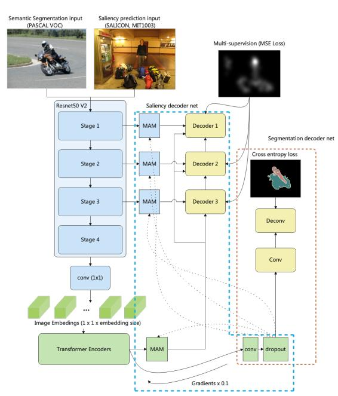
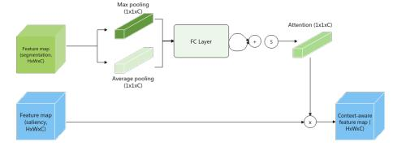
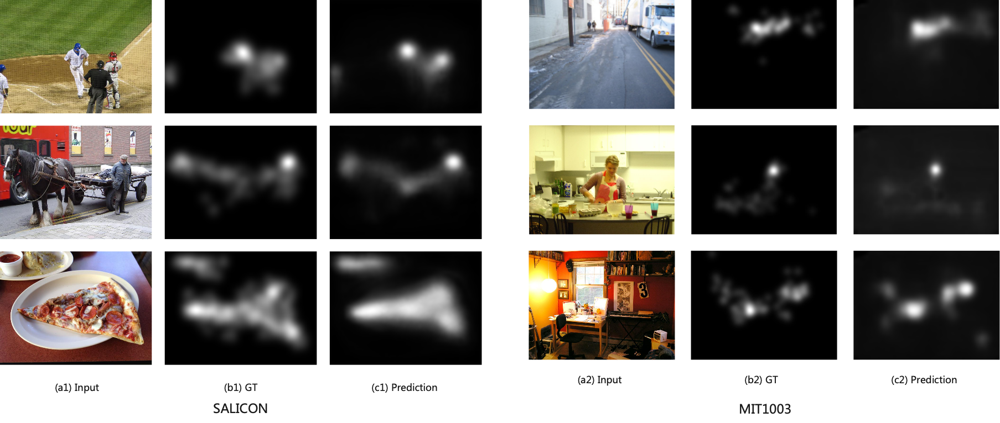
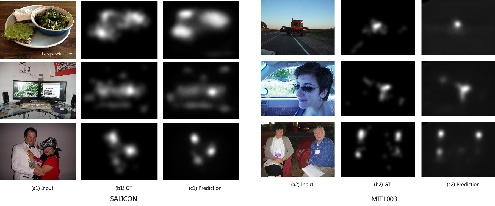

# Source code of Zhang Shuo's dissertation
For the degree of Master of Computing at NUS. 

## Description
Saliency Prediction aims to predict attention distribution of
human eyes given an RGB image. Most of the recent state-of-the-art methods are based on abstract and deep image representations, taking
advantage of traditional CNNs. However, the traditional convolutional
structure could not capture the global feature of the image well due to its
small kernel size. And the high-level factors which closely correlates to
human visual perception, e.g., objects, color, light, etc., are not considered.
Inspired by these, we propose transformer based method with semantic
segmentation as another learning objective. More global cues of the image
could be captured by transformer and simultaneously learning the object
segmentation simulates the human visual perception. Our ablation and
visualization experiments show the effectiveness of the proposed ideas. Our
model achieves competitive performance compared to other state-of-the-art
methods. We are among top five in [SALICON benchmark](https://competitions.codalab.org/competitions/17136#results) (user name: shuo3). We are among top two (traditional evaluation, user name: HATES) in [MIT300 benchmark](https://saliency.tuebingen.ai/) (top five including probabilistic evaluation).

The link to the dissertation will be here
soon.

## Installation
1. We use Anaconda as the basic environment. Please create a new vitual environment by
 ```conda create -n pytorch python=3.6 (or 3.7)```.
2. Install the dependencies by ```pip install -r requirements.txt``` (if necessary).
The requirements.txt is provided in this package.

## Architecture



The first figure shows the architecture overview, while the second shows the MAM module.

## Preparing datasets
Please download SALICON and MIT1003 datasets at http://salicon.net/challenge-2017/ and https://saliency.tuebingen.ai/.
SALICON is the largest dataset collected by mouse clicking in the field of saliency, in LSUN workshop at CVPR'17 conference. MIT1003 is the most famous benchmark collected by eye tracking device.
**Place the datasets in the same root dir as the code.**

SALICON:

Please organize the data as follows after downloading:
```
salicon
└───images
│     │   *.jpg
|     |
└───maps
      │   *.png
```

MIT1003:

The data organization is the same as SALICON. Then please preprocess the data to make the image sizes consistent:
```commandline
cd root_of_mit1003_dir
mkdir ../mitdata
mkdir ../mitdata/images
mkdir ../mitdata/maps
python preprocess_data_mit1003.py
```
The processed data is in the ```mitdata``` folder.

## Training
Please first download the imagenet pretrained transformer model from [TransUnet](https://github.com/Beckschen/TransUNet), and 
place the model under ```backbone``` dir. We use pretrained model for better result.
```commandline
# train on salicon
python train_salicon.py --data_dir your_data_path --output_folder path_of_saved_models

# train on mit1003
python train_mit1003.py --data_dir your_data_path --output_folder path_of_saved_models
```

## Test
```commandline
# salicon, set save_segmentation as True if you want to output the segmentation.
python eval_salicon.py --image_model_path path_of_your_model --save_segmentation True

# mit1003
python eval_mit.py --image_model_path path_of_your_model
```
Here we give the **[official evaluation for salicon dataset](https://github.com/matthias-k/pysaliency)**. Please change
the output_dir in the code first.
```commandline
python calculate_scores_salicon.py
```

## Some saliency prediction results



## Acknowledgements
The code is heavily based on [TransUnet](https://github.com/Beckschen/TransUNet), [EML-Net](https://github.com/SenJia/EML-NET-Saliency) and [pytorch-fCN](https://github.com/wkentaro/pytorch-fcn).
The official evaluation is from [pysaliency](https://github.com/matthias-k/pysaliency).